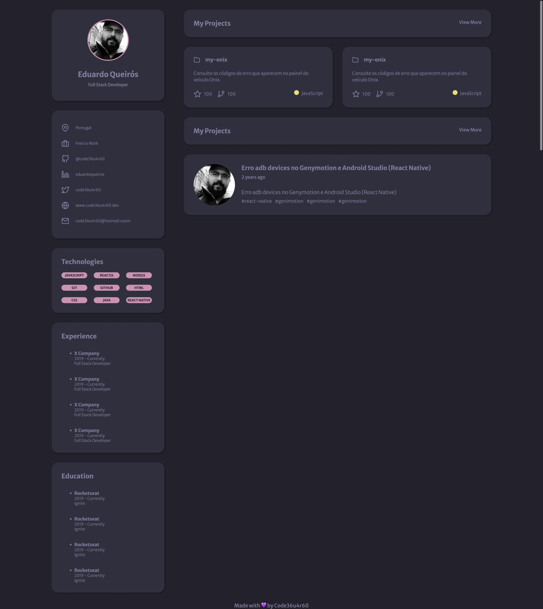

<h1 align="center">Portfólio</h1>

  <a href="#-tecnologias">Tecnologias</a>&nbsp;&nbsp;&nbsp;|&nbsp;&nbsp;&nbsp;
  <a href="#-projeto">Projeto</a>&nbsp;&nbsp;&nbsp;|&nbsp;&nbsp;&nbsp;
  <a href="#-layout">Layout</a>&nbsp;&nbsp;&nbsp;|&nbsp;&nbsp;&nbsp;
  <a href="#memo-licença">Licença</a>

  

 

## 🚀 Tecnologias

Esse projeto foi desenvolvido com as seguintes tecnologias:

- HTML
- CSS

## 💻 Projeto

Este projeto foi realizado como um desafio para relembrar um pouco sobre as tecnologias envolvidas.

## 🔖 Layout

Layout do projeto: [aqui](https://www.figma.com/file/Zyg6mSqKTEiWwjKWIZbmrz/DD-Portfolio-Copy).
É necessário ter conta no [Figma](https://figma.com).

## :memo: Licença

Esse projeto está sob a licença MIT. Veja o arquivo [LICENSE](LICENSE.md) para mais detalhes.

---

Feito com ♥ by Eduardo Queirós @Code36u4r60 :wave:
